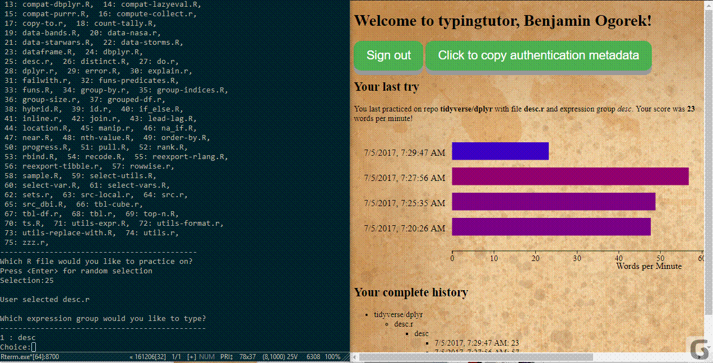

`typingtutor`: A typing tutor and code familiarizer for R
=========================================================

[](https://travis-ci.org/baogorek/typingtutor)

[](https://codecov.io/github/baogorek/typingtutor?branch=master)


typingtutor is an R package that provides typing exercises based
on R packages on github. Its purpose is to increase the user's speed of
typing in general and typing R code in particular, with the side bonus of
gaining familiarity with the code underlying successful R packages.





## Installation
```
devtools::install_github("baogorek/typingtutor")
```


