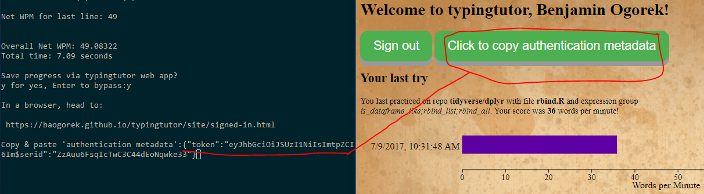

`typingtutor`: A typing tutor and code familiarizer for R
=========================================================

[](https://travis-ci.org/baogorek/typingtutor)

[](https://codecov.io/github/baogorek/typingtutor?branch=master)


typingtutor is an R package that provides typing exercises based
on R packages on github. Its purpose is to increase the user's speed of
typing in general and typing R code in particular, with the side bonus of
gaining familiarity with the code underlying successful R packages.

[*The typingtutor website*](https://baogorek.github.io/typingtutor/site/signed-in.html)


## Installation
As *typingtutor* is only available on Github, the easiest way to install it is
via [devtools](https://github.com/hadley/devtools):
```
install.packages("devtools")
devtools::install_github("baogorek/typingtutor")
```

## Usage
After starting R, load the typingtutor library:

```
library(typingtutor)
```

To practice typing on the Github repo *tidyverse/dplyr*, simply enter
```
type_github()
```
or, for another repo, enter the Github repository path as an argument:
```
type_github("stefvanbuuren/mice")
```

The user is presented with a choice of R files and then groups of R expressions
within those files for which to type on. A maximum of 1000 characters will be
presented to the user, and functions longer than 1000 characters are truncated.

## The typingtutor companion webpage 

You can always get to the
[typingtutor companion website](https://baogorek.github.io/typingtutor/site/signed-in.html)
by typing `visit_site()` in R or by visiting

```
https://baogorek.github.io/typingtutor/site/signed-in.html
```
which will redirect to
```
https://baogorek.github.io/typingtutor/
```
if the user is not signed in. Currently, a
[Github account](https://github.com/join) is required for
authentication to the typingtutor companion page. 

### Saving data
After practicing on a typing tutor expression group, the user will be given the
option to save to the typingtutor companion page. For the first time in every
new R session, the user will have to enter a "authentication metadata string"
at a prompt. Once signed into the typingtutor companion webpage, this is
accomplished by clicking the green button, pressing CTRL + C and Enter, and
pasting the resulting string back into the R prompt.



Saving is optional, and the user may use the typingtutor without ever saving
to the typingtutor companion webpage.
